# **Regression Analysis: Decisive Factors and Prediction of Health Insurance Premium**

**Author:**  
Hao-Chun(Oscar) Shih

## **Research Motivation and Purpose**  
This project aims to use data analysis to construct predictive models of health insurance premiums. By considering variables such as gender, family structure, and health metrics, the goal is to determine how these factors influence medical expenses and apply the findings to forecast actual market prices.

---

## **Data Overview**

### **Variables:**
- **Age** (numeric)
- **Sex** (male/female)
- **Children** (numeric)
- **Smoker** (yes/no)
- **Region** (SW, SE, NW, NE)
- **Expenses** – Response variable

### **Data Insights:**
- **Key Relationships**:
  - **BMI**, **Smoker status**, and **Age** show a significant correlation with medical expenses.
  - **Region** has little to no relation with expenses.
  - **Sex** does not significantly affect the model and was removed during analysis.
- No missing values in the dataset.
- 

---

## **Data Processing and Transformation**
1. **Dummy Variables**:
   - Smoker: Yes (1), No (0)
   - Regions transformed to dummy variables: SE, NW, NE, SW
2. **Correlation Matrix**:
   - Strong positive correlation between **Smoker** and **Expenses**.
   - Positive correlations with **Age** and **BMI**.
3. **Visualizations**:
   - Expenses are consistently higher for smokers.
   - Higher BMI correlates with higher expenses, especially among smokers.
   - No significant variation in expenses between regions or genders.
   - **Number of children** tends to decrease expenses, though data is sparse for large families.

### Age vs Number of Children EDA
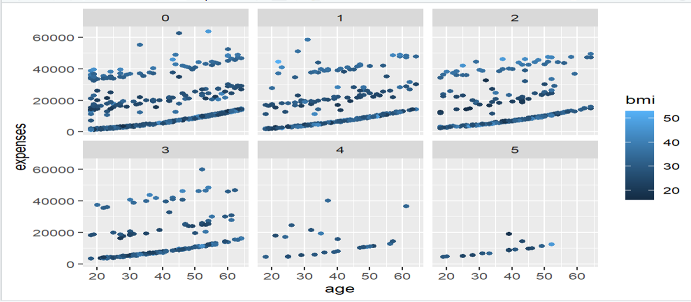

### Region, Sex, Smoking EDA
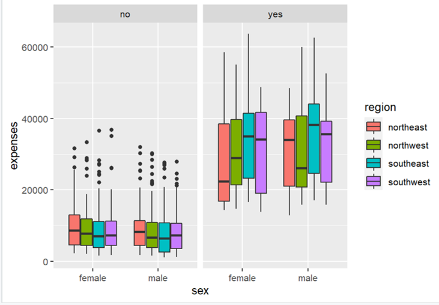

### BMI vs Smoking EDA
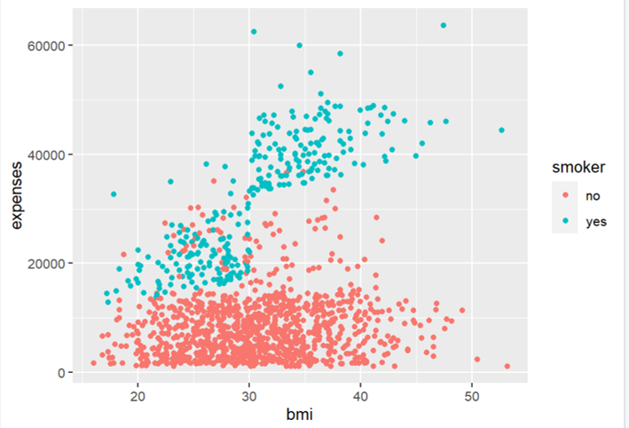  
---

## **Regression Models**

### **Multiple Regression (Part 1)**

1. **Model Building**:
   - Established a full model and used stepwise selection (using `ols_step_both_p` in `olsrr`).
   - Final variables: **Age**, **BMI**, **Children**, and **Smoker**.
   - **Region** was removed (p-value = 0.09, failing to reject the null hypothesis).
  
### Adjusted R² and CP Variable Selection
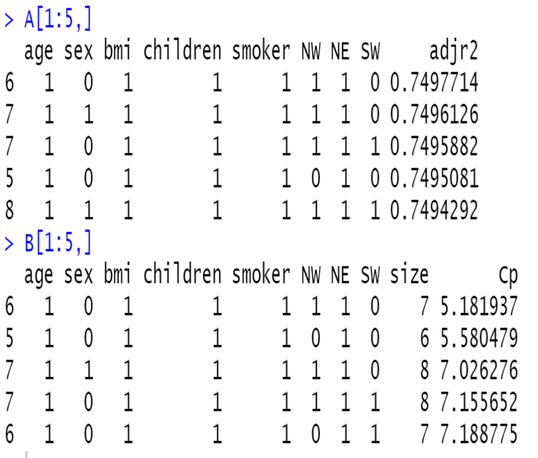

2. **Model Verification**:
   - No multicollinearity issues (VIF < 2).
   - Model had an **adjusted R² of 0.76**.
   - Residual analysis identified issues, especially with residuals vs. fitted values and the QQ plot.
   - Applied **log transformation** to improve residual patterns:
     - Before Transformation:  
       `Expenses = -12105.5 + 257.8(Age) + 321.9(BMI) + 473.7(Children) + 23810.3(Smoker_Yes)`
     - After Transformation:  
       `log(Expenses) = 6.983 + 0.03478(Age) + 0.0106(BMI) + 0.1012(Children) + 1.54321(Smoker_Yes)`

### VIF and ANOVA - Simple Regression
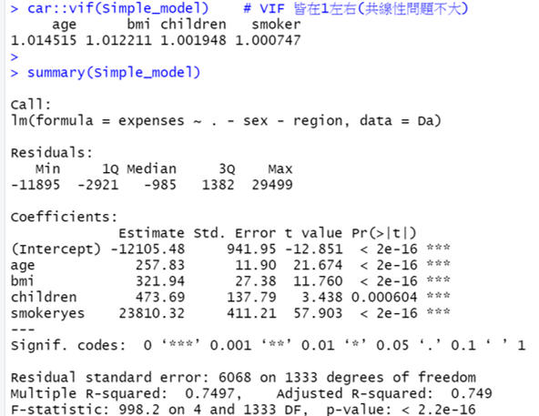

### BoxCox Transformation - Multiple Regression
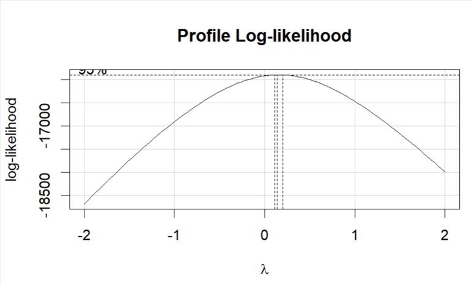

### Residual Analysis - Multiple Regression
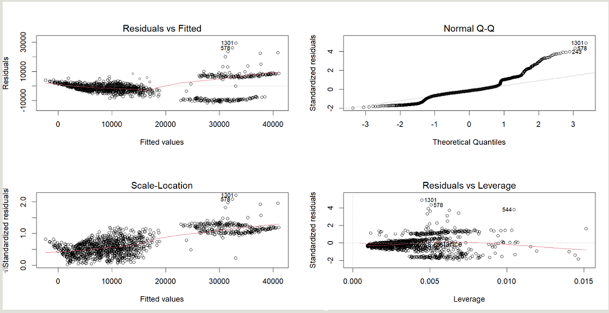

### Added Variable Plot
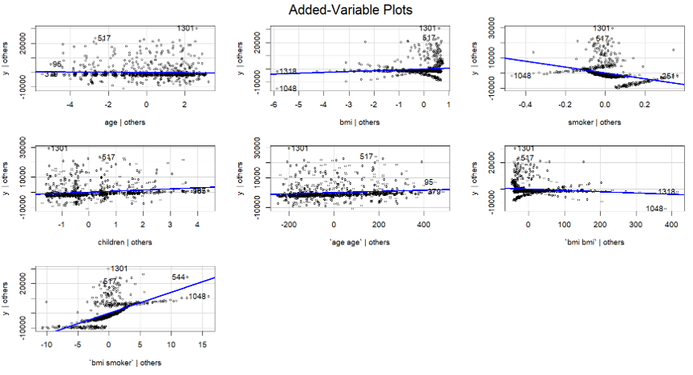

3. **Cross-Validation**:  
   - **R² = 0.76** from Leave-One-Out Cross Validation (LOOCV).

### **Polynomial Regression (Part 2)**

1. **Model Selection**:
   - Expanded variables with second-order terms (e.g., **Age²**, **BMI*Smoker**).
   - Final variables: **BMI**, **Children**, **Age²**, **BMI²**, **BMI*Smoker**.

2. **Transformation**:
   - Used **Box-Cox** transformation to optimize lambda = 0.25.
   - Improved residuals but residual vs. fitted plot showed structural issues.

### Residual Analysis Before Transformation
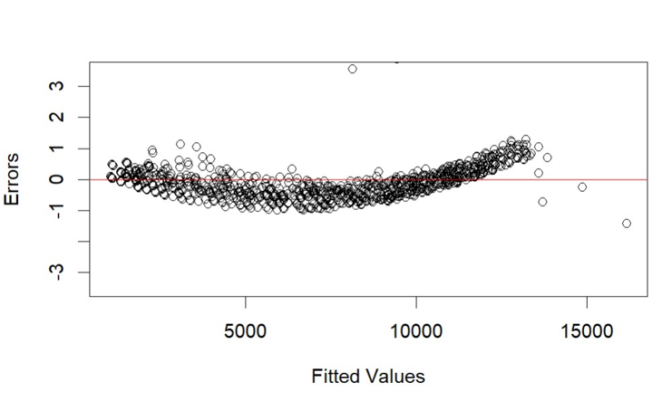

### Residual Analysis After Transformation

3. **Performance**:
   - **R² = 0.84** with LOOCV.
   - Final model after transformation:  
     `(Expenses)^0.25 = -4.029 - 0.067(Age) + 0.131(BMI) - 0.457(Smoker) + 0.212(Children) + 0.0001(Age²) - 0.002(BMI²) + 0.149(BMI * Smoker)`

### **Random Forest (Part 3)**

1. **Data Splitting**:
   - Split data into training (80%) and testing (20%).
   
2. **Model Performance**:
   - **Variable importance**: **Smoker** and **BMI** were the most important factors.
   - **R² = 0.84** on the test set.
   - Random Forest achieved close agreement between predicted and actual values, showing robust performance.

### Predicted vs Ground Truth (Random Forest)
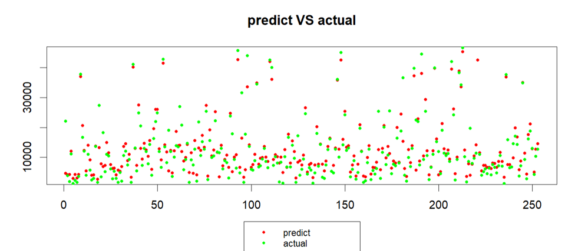
---

## **Conclusion**

### **Model Comparison**:
| Model                      | R² (Adjusted) | RMSE   | MAE    |
|-----------------------------|---------------|--------|--------|
| Multiple Regression          | 0.76          | 5959   | 4027   |
| Polynomial Regression        | 0.84          | 4888   | 2909   |
| Random Forest (Test Set)     | 0.84          | 4814   | 2884   |

- **Multiple Regression** offers a simplified model with decent prediction accuracy but has limitations in residual analysis.
- **Polynomial Regression** provides better predictive accuracy and R², though still exhibits some residual issues.
- **Random Forest** demonstrates the strongest predictive performance, particularly under Big Data scenarios.

### Results on Full Dataset
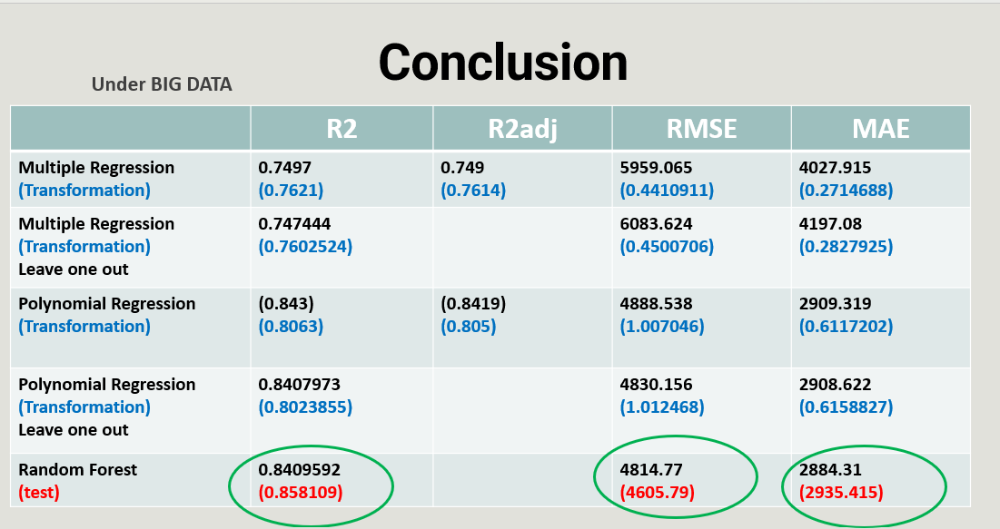

### Results on Small Dataset
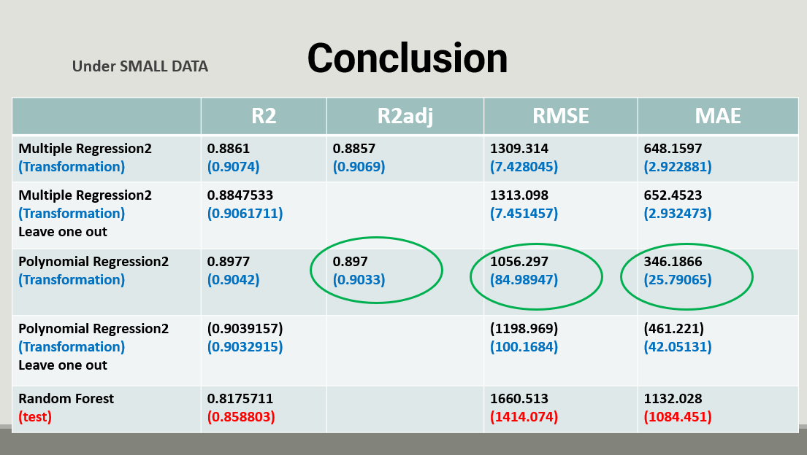

### **Final Thoughts**:
- **Smoker**, **BMI**, and **Age** are the most influential factors in determining health insurance premiums.
- While **Region** and **Sex** do not significantly affect expenses, **BMI** and **Smoker** show a strong interaction effect, significantly influencing costs.
- Random Forest proves to be a strong model, outperforming others in predictive power.

---

## **References**  
- [Medical Cost Personal Datasets | Kaggle](https://www.kaggle.com/)
- [Performance of the Random Forest Algorithm](https://www.researchgate.net/)

---
